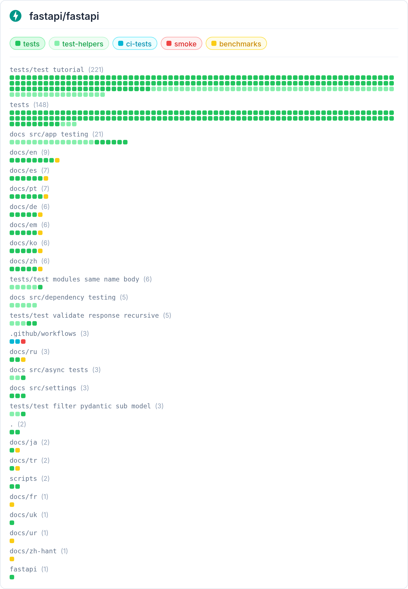

# Explorando Práticas de Teste

Neste exercício, vamos explorar práticas de teste em sistemas reais utilizando a ferramenta [TestMiner](https://andrehora.github.io/testminer).

O TestMiner permite visualizar e analisar testes de software em repositórios do GitHub, fornecendo dados sobre como os projetos organizam seus testes, como eles evoluem entre versões e quais bibliotecas de teste são utilizadas.
Explore a ferramenta antes de começar para se familiarizar com seu funcionamento.

---

## Passo 1: Selecionar um repositório

Escolha um repositório real que possua testes escritos na linguagem de sua preferência.
Abaixo estão alguns links para ajudá-lo a encontrar projetos interessantes:

- **Python:** https://github.com/topics/python?l=python
- **JavaScript:** https://github.com/topics/javascript?l=javascript
- **TypeScript:** https://github.com/topics/typescript?l=typescript
- **Java:** https://github.com/topics/java?l=java

## Passo 2: Explorar o repositório selecionado

Busque o repositório escolhido no [TestMiner](https://andrehora.github.io/testminer) e analise os dados de teste gerados pela ferramenta.

## Passo 3: Explicar uma prática de teste

Com base nos dados obtidos, selecione uma prática ou dado de teste relevante e explique-o com suas próprias palavras.

---

## Instruções de entrega

1. Faça um `fork` deste repositório (saiba mais sobre forks [aqui](https://docs.github.com/pt/pull-requests/collaborating-with-pull-requests/working-with-forks/fork-a-repo)).
2. Responda às questões abaixo diretamente neste arquivo `README.md` do seu fork. Pode adicionar imagens para enriquecer sua explicação.
3. No Moodle, submeta apenas a URL do seu fork.

---

## Respostas

**1. Repositório selecionado:** [https://github.com/fastapi/fastapi](https://github.com/fastapi/fastapi)

**2. Explicação:** O repositório escolhido foi o do FastAPI. Um breve resumo: o FastAPI é um framework web moderno e amplamente utilizado para a construção de APIs em Python. Ele é reconhecido pela sua robustez e simplicidade. A imagem a seguir apresenta o mapeamento da localização dos testes gerado pela ferramenta TestMiner. O gráfico lista os diretórios do projeto com pontos coloridos indicando o volume e a categoria de cada arquivo de teste.

O que mais chamou a minha atenção é a densidade do diretório `tests/test_tutorial`, que lidera com 221 arquivos (a maioria composta por testes e helpers). Em segundo lugar, aparece a pasta raiz tests (148 arquivos). Além disso, há uma distribuição de testes espalhados por pastas relacionadas à documentação.

O fato de a maior concentração de testes do projeto estar na pasta `test_tutorial` revela que os trechos de código e os exemplos ensinados na documentação oficial e nos tutoriais do site são, na verdade, os próprios testes automatizados do framework. Em vez de escrever testes isolados que ninguém vê e uma documentação separada que pode ficar desatualizada, ambos foram unificados. Todo código de exemplo é executado pela suíte de testes.

Isso reduz bastante o risco de a documentação ficar defasada. Se uma nova atualização no código quebrar o funcionamento de uma funcionalidade, o exemplo do tutorial vai falhar como um teste quebrado. Essa é uma prática que não conhecia, mas faz total sentido e é muito interessante.